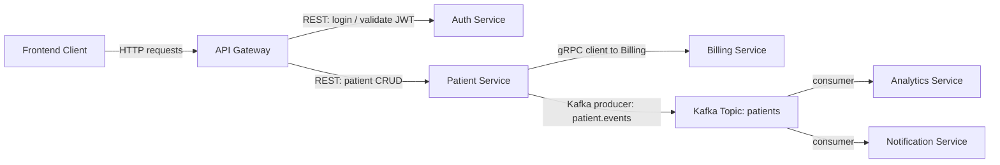
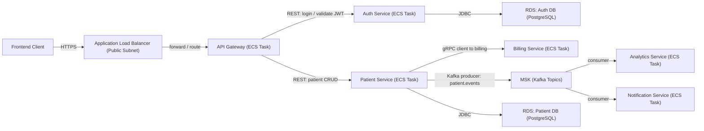

# 🏥 Healthcare Management System — Microservices

A **production-ready healthcare system** for managing patients, built with **Java, Spring Boot, Kafka, Docker, AWS, and
enterprise-grade microservice patterns**. The project demonstrates real-world system design, API security, event-driven
communication, and cloud deployment.

### Key highlights:

- Enterprise-grade microservices architecture built with **Spring Boot**
- Asynchronous, event-driven communication with **Kafka**
- Hybrid service communication with **REST + gRPC**
- Secure distributed APIs using **JWT** and **API Gateway**
- Cloud deployment with **AWS** and **Infrastructure as Code**
- Production-ready monitoring: **Micrometer** → **Prometheus** → **Grafana**, resilience with **Resilience4j**
- Automated integration & API testing with **Testcontainers** and **Rest Assured**

## 🛠 Tech Stack

- **Java 21**
- **Spring Boot 3**
	- **Spring Web** — REST APIs
	- **Spring Security** — authentication & authorization with JWT
	- **Spring Data JPA** — persistence with PostgreSQL
	- **Spring Validation** — request validation (DTOs, constraints)
	- **Spring Actuator** — health checks & metrics
	- **Spring Cloud** — integrations with AWS services
	- **Spring Cloud Gateway** — API gateway (routing, rate limiting)
	- **Springdoc OpenAPI** — generate Swagger/OpenAPI docs

- **PostgreSQL** - DB for each microservice (RDS in prod / Docker image in dev)
- **Apache Kafka** — event-driven communication (MSK in prod / Docker broker in dev)
- **Redis** — caching
- **gRPC** — inter-service communication (alongside REST APIs)
- **Docker & Docker Compose** — containerization & orchestration
- **AWS ECS, RDS, MSK, CloudMap** — cloud deployment
- **Localstack** — AWS cloud simulation for local dev
- **Micrometer + OTEL + Prometheus + Grafana** — observability & monitoring
- **Resilience4j** — circuit breakers, retries, fault tolerance
- **Testcontainers + Rest Assured** — integration and API testing

## 🏗️ Development Architecture (Docker Network)

- Auth Service — handles user authentication & JWT validation
- Patient Service — CRUD operations & patient events (Kafka producer)
- Billing Service — gRPC server for billing operations
- Analytics Service — Kafka consumer for patient/billing analytics
- Notification Service — Kafka consumer for notifications
- API Gateway — routes client requests, applies rate limiting & auth filters

## 🌐 Deployment Architecture (AWS ECS + RDS + MSK)

- ECS Cluster hosting microservices
- RDS for Postgres DBs
- MSK for Kafka topics
- Application Load Balancer + API Gateway
- Infrastructure defined as code
- Tested locally with Localstack before real cloud deployment

## 🗺️ Project Roadmap

### Part 1 — Core Setup

- Patient Service (CRUD, REST, DB, Docker)
- Billing Service (gRPC server, Docker)
- Patient ↔ Billing via gRPC
- Kafka integration (producer/consumer)
- Analytics Service (Kafka consumer)
- API Gateway setup
- Auth Service (JWT login/validation)
- Infrastructure as Code (CloudFormation basics)

### Part 2 — Advanced Features

- Patient API Pagination & Filtering
- Redis caching integration
- Rate limiting with Spring Cloud Gateway
- Circuit breakers & fallbacks with Resilience4j
- Observability with Prometheus & Grafana
- Service discovery with AWS CloudMap

### Part 3 — CQRS & Extensions

- Appointment Service (CQRS pattern)
- Cached patient repository for fast lookups
- Kafka event-driven updates
- Deployment to Localstack ECS + MSK + RDS
- End-to-end testing & troubleshooting

### Part 4 - Final Steps

- Add CI/CD pipeline (GitHub Actions)
- Implement full appointment scheduling workflows
- Extend security with OAuth2 / Keycloak
- Scale microservices in Kubernetes (future iteration)

## 📊 Monitoring & Observability

- Spring Boot Actuator metrics
- Prometheus scrape config for services
- Grafana dashboards for system health
- Custom metrics (cache misses, request latency)

## 🔐 Security

- JWT-based authentication & authorization
- API Gateway enforcing security rules
- Rate limiting & abuse protection
- Encrypted communication (TLS setup in production)

## 🧪 Testing

- Unit tests with JUnit 5
- Integration tests with Testcontainers for production-like environment
- API tests with Rest Assured
- Kafka producer/consumer tests
- Automated rate-limit tests for API Gateway

